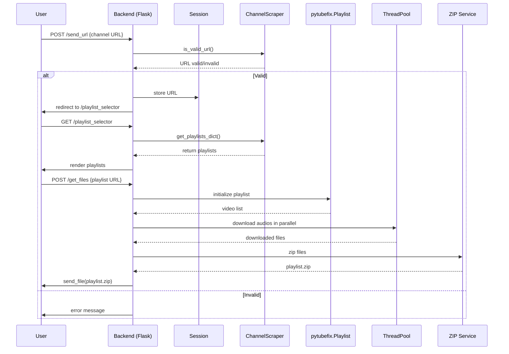

## 📦 YouTube Channel & Playlist Downloader


A sleek **Flask web app** that allows users to explore a YouTube channel and download entire playlists as zipped audio files. ⚡

---

## 🚀 Key Features

* 🔍 **Channel Lookup**: Paste a YouTube channel URL and fetch its public playlists.
* 📃 **Playlist Selector**: Browse and preview playlist titles and thumbnails.
* ⚙️ **Multithreaded Downloads**: Audio is downloaded using `ThreadPool` for fast, parallel processing.
* 🗜️ **ZIP Compression**: All tracks are zipped into a single file for convenient download.
* ✨ **Immersive UX**: Aurora-style background, modern UI, loading feedback animations.

---

## 🧠 What I Learned

1. ✅ **Flask Session Handling**: How to manage persistent user state (channel URL, playlist selection).
2. ⚡ **ThreadPool**: Parallelizing audio downloads for efficiency.
3. 🧼 **Temporary File Management**: Using `tempfile` and `shutil` to manage and clean up temp storage.
4. 🖼️ **Dynamic UI Feedback**: Combining JS fetch with CSS transitions for responsive user experience.
5. 📈 **Documenting with Mermaid**: Using diagrams to visualize backend workflows.

---

## 🗺️ App Workflow



---

## ✨ Code Highlights

* 🔐 **URL Validation**:

  ```python
  def is_valid_url(self):
      return requests.get(self.channel_url).status_code == 200 and "youtube.com" in self.channel_url
  ```

  Ensures valid and reachable YouTube channel before proceeding.

* 📦 **Playlist Parsing**:

  ```python
  def get_playlists_dict(self):
      return pool.map(lambda p: {"title": p.title, "url": p.playlist_url, "thumbnail_url": p.thumbnail_url}, playlists)
  ```

  Extracts playlist metadata in parallel.

* 🧵 **Threaded Audio Download**:

  ```python
  with ThreadPool(processes=8) as pool:
      pool.map(download, ((video, download_folder) for video in selected_playlist))
  ```

  Speeds up large playlist downloads.

* 📁 **Temporary ZIP Creation**:

  ```python
  with zipfile.ZipFile(zip_path, "w") as zipf:
      for file in os.listdir(playlist_folder):
          zipf.write(os.path.join(playlist_folder, file), arcname=os.path.join("playlist", file))
  ```

  Packs all audio files for download.

* 🌐 **Frontend Fetch Handling**:

  ```js
  const response = await fetch("/send_url/", { method: "POST", body: JSON.stringify({url: channel.value}) });
  ```

  Seamless client-server communication with real-time feedback.

---

## 🛠️ Project Structure

```
├── app.py               # Flask backend
├── ChannelScraper.py    # YouTube scraping logic
├── templates/
│   ├── mainPage.html
│   └── playlistSelector.html
├── static/
│   ├── mainPageStylesheet.css
│   └── playlistSelector.css
└── requirements.txt     # Python dependencies
```

---

## 🧪 How to Run Locally

```bash
# Clone repo
git clone <project-url>
cd youtube-downloader

# Set up virtual environment
python -m venv venv
source venv/bin/activate

# Install dependencies
pip install -r requirements.txt

# Run the server
python app.py
```

---
## Legal

- [Terms & Conditions](TERMS_AND_CONDITIONS.md)
---
Enjoy downloading your favorite YouTube playlists! 🎉
